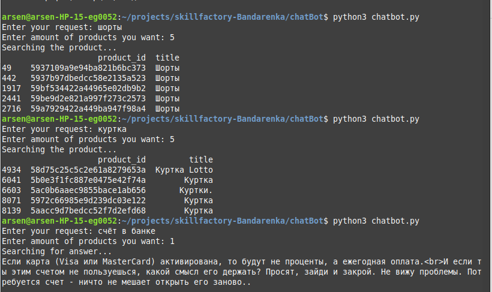

## Overview
The chatbot is made for the internet store to help in searching products. The chatbot determines your query. If the query is about a product from the store, the chatbot returns one or more (depending on your query) products (id and product title) that are most suitable for your request. If the chatbot determines that your request is not related to the product, it returns an answer to your question.
## How to use
Run the [chatbot.py](chatbot.py) file, enter the query, and after entering the number of products you want to get, the amount should be an integer. Wait for an answer.

**Note**: chatbot works better in russian language.
## How it works
There is a dataset with products available on sale in stores. There is a file with questions and answers on different topics from the social network (more than 1 million questions and answers, but we use only 300K in the chatbot to reduce memory usage). Both these text sets were transformed into vectors, each separately, to build an algorithm for finding the closest answer by query. There are 3 functions that play the main role in the chatbot. After entering the query, the function "classificator" classifies the query, is it product request or not. If the request is about product, it calls "find_item" function, that returns the product (or products) that suits most. If the query classifies as not about product, "speaker_answer" function is calling, the function finds the most suitable answer from the prepared answers. 
## Libraries in project:
[Gensim Word2Vec](https://radimrehurek.com/gensim/auto_examples/tutorials/run_word2vec.html#sphx-glr-auto-examples-tutorials-run-word2vec-py): to vectorize text from "prepared answers" document, one vector per word.

[Scikit-learn HashingVectorizer](https://scikit-learn.org/stable/modules/generated/sklearn.feature_extraction.text.HashingVectorizer.html): to vectorize a collection of product titles into sparse matrix, one sparse vector per title.

[Scikit-learn TruncatedSVD](https://scikit-learn.org/stable/modules/generated/sklearn.decomposition.TruncatedSVD.html): to transform sparse matrix (after HashingVectorizer processing) into numpy arrays.

[Scikit-learn LogisticRegression](https://scikit-learn.org/stable/modules/generated/sklearn.linear_model.LogisticRegression.html#sklearn.linear_model.LogisticRegression): to classify the query (about product or not).

[Annoy Index](https://github.com/spotify/annoy) (library to search for points in space that are close to a given query point): to find the most suitable product or answer.
